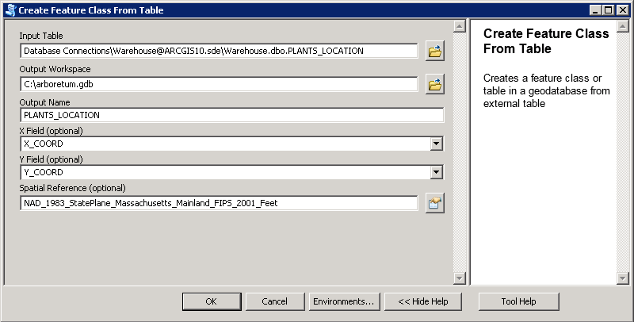
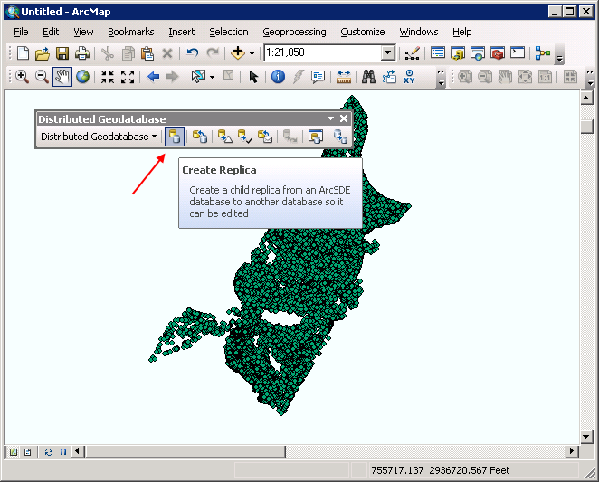
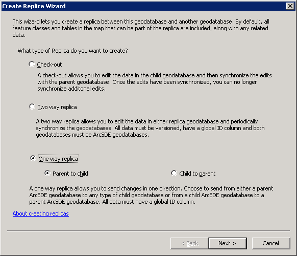
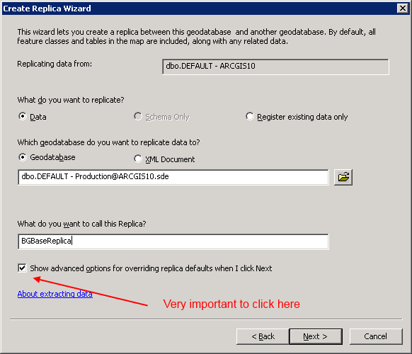
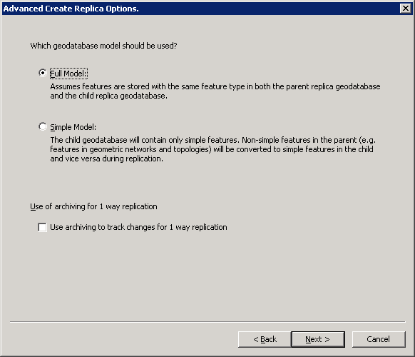
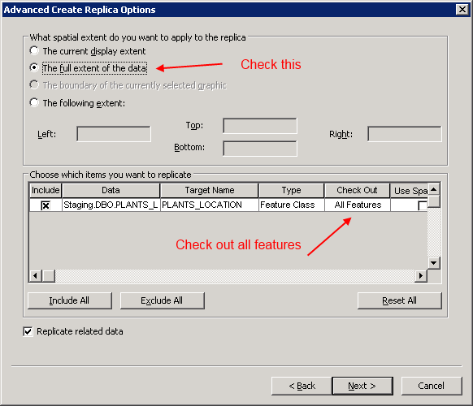
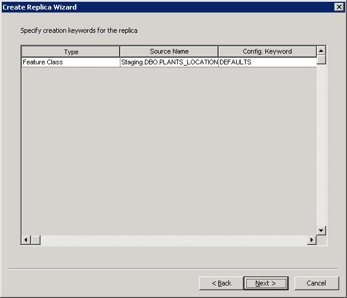
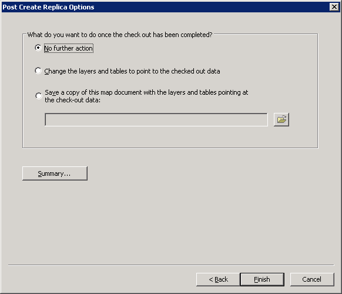

##Arnold Arboretum *BG-BASE* - SQL Server Connector
###Overview
The Arnold Arboretum BG-BASE - SQL Server Connector, referred to as *BG-Connector* from here on out, is a library that is written in Python to faciliate the movement of data
bewtween the Arboretum's BGBASE database and its ArcGIS SDE database. The BG-Connector contains 2 files that are launched from the Python executable
to move the Arboretum's data: **_sqlserver_to_sde.py_** and **_sde_to_xml.py_**. The code is controlled by a configuration file, **_config.py_**, that indicates
where various data sources exist, as well as other settings, such as the location of log files.

BG-Connector uses Python 2.7, the 32-bit Python ODBC client (pyodbc) to interact with the Warehouse database and the ArcGIS Python library (arcpy) to interact with the ArcGIS database.

###General System Architecture
The BG-Connector is made up of multiple systems. Arnold Arboretum uses *BG-BASE* to maintain its plant information, and uses ArcGIS Server to make its data spatially available.
A non-spatial database sits in between the *BG-BASE* database and ArcGIS database that is critical in getting the changes from *BG-BASE* to ArcGIS. This non-spatial database
is a SQL Server database, and the database is configured to use Change Data Capture (CDC) to track changes.

*BG-BASE* and the Arnold Arboretum designed a relational database in SQL Server that is a representation of *BG-BASE* data. This database is named **Warehouse**.
When changes are made in the *BG-BASE* database, the *BG-BASE* software will replicate these changes in the Warehouse database using an ODBC connection. The tables
that are updated in Warehouse must have CDC enabled in order for the changes to propagate to ArcGIS. When called using the **sqlserver_to_sde.py** code,
the BG-Connector will read the changes from the CDC tables, and will apply the changes from the Warehouse database to the ArcGIS database.

The BG-Connector requires an ArcGIS Geodatabase Replica in order to propagate changes from the spatial database to the *BG-BASE* database. The replica is a one-way
replica, with changes moving from the parent replica to the child replica. In the Arboretum's system, the parent replica is contained in a database named **Staging**,
and the child replica is contained in a database named **Production**. Users make edits in the Staging geodatabase, and then run the BG-Connector's **sde_to_xml.py**
code that will generate an XML data change file and place the file in a location that is known to *BG-BASE*. *BG-BASE* will pick up the change file, and will update
the internal *BG-BASE* database.

*It is important to note that the BG-Connector only supports updates that are made in the ArcGIS database. New records from ArcGIS will not be applied to BG-BASE.*

###Code Structure
BG-Connector has the following code structure:

* *config.py*: This top level file is a Python dictionary that configures the BG-Connector.
* *sde_to_xml.py*: This top level file loads the BG-Connector API to generate the XML change file for changes that originated in the geodatabase.
* *sqlserver_to_sde.py*: This top level file loads the BG-Connector API to import changes that originated in *BG-BASE* into the geodatabase.
* *connector*: Package containing the implementation files of the BG-Connector API.
	* *db.py*: File that contains Python classes that encapsulate database functionality.
		* *Replicas*: Python class that parses replicas from the config file.
		* *Replica*: Python class that encapsulates a replica. A replica contains an array of Datasets and manages the ODBC connection to the SQL Server.
		* *Dataset*: Python class that encapsulates a dataset. A dataset has a properties for a SQL Server table and a geodatabase dataset. The dataset class also contains functions that are used to read and parse data changes from the SQL Server CDC tables.
	* *io.py*: File that contains Python classes that encapsulate import and export functionality of the BG-Connector.
		* *SqlServerImporter*: Python class that is called by the sqlserver_to_sde to import changes from the CDC tables into the geodatabase.
		* *GeodatabaseExporter*: Python class that is called by the sde_to_xml to generate an XML change file between geodatabase replicas.
	* *util*: File containing utility classes.
		* *DBUtil*: Python class that provides helper functions for ODBC objects.
		* *DateUtil*: Python class that provides helper functions for Date/Time objects.
		* *LockFile*: Python class that helps the Connector from running in multiple instances.

###Data Preparation
First, a SQL Server instance of the *BG-BASE* database must be created. This is standard functionality within *BG-BASE*, implemented by *BG-BASE*.

Once the data is ready in Warehouse, CDC must then be enabled per table that is to be managed in ArcGIS. 

###CDC Setup
The following are steps in order, to set up the SQL Server to work as a BG-Connector.

Warehouse Database Enable CDC
There are several steps to follow in order to create tables that are editable by ArcGIS. The first step involves enabling CDC (Change Detection Capture) on a database.

Enable database:
USE *databasename*
GO 
EXEC sys.sp_cdc_enable_db 
GO

If an error message is encountered, you can try:
USE *databasename*
GO 
EXEC sp_changedbowner 'sa' 
GO

Enable table(s):
USE *databasename*
GO
EXEC sys.sp_cdc_enable_table
@source_schema = N'dbo',
@source_name = N'TABLE_NAME’,
@role_name = N'CDC_admin'
GO

PLANTS table:  when enable cdc on table correctly you should get this message:
Job 'cdc.Production_capture' started successfully.
Job 'cdc.Production_cleanup' started successfully.
Note: @role_name. If there is any restriction of how data should be extracted from database, this option is used to specify any role which is following restrictions and gating access to data to this option if there is one. If you do not specify any role and, instead, pass a NULL value, data access to this changed table will not be tracked and will be available to access by everybody.
Reference: http://lennilobel.wordpress.com/2010/02/13/using-sql-server-2008-change-data-capture/

Change tables are generated in the database System Tables with unique fields that indicate what action was performed:
INSERT (_$operation = 2)
UPDATE (_$operation = 3 [before]; _$operation = 4 [after])
DELETE (_$operation = 1)
Reference: http://msdn.microsoft.com/en-us/library/bb500305.aspx

CDC SYNC TABLES
There's a table named dbo.SDE_SYNC_TABLES in Warehouse SQLServer 2008 database that contains records of CDC table names and functions, and SDE feature class names that controls the python code. The python code iterates through this table, and calls the CDC function to get the changes from the CDC table and put them in the feature class. -6/7/13 Jason Sardano

SQL Server Agent
Once you have the database and desired tables with CDC’s enabled, you must start SQL Server Agent or the changes will not be captured.  
To start the Agent: 
1.	On the Start menu, point to All Programs, point to Microsoft SQL Server 2008 R2, point to Configuration Tools, and then click SQL Server Configuration Manager.
2.	In SQL Server Configuration Manager, expand Services, and then click SQL Agent.
3.	In the results pane, right-click any instance, and then click Start. A green arrow on the icon next to the SQL Server Agent and on the toolbar indicates that SQL Server Agent started successfully.
4.	Click OK.
Our SQL server Agent kept turning off. If you encounter this problem you can try configuring according to this document: http://technet.microsoft.com/en-us/magazine/gg313742.aspx, but already had this configuration. I went into SQL Server Configuration Manager and change the SQLServerAgent Start Mode from Manual to Automatic.

Create Multiversion view 
Just a view or query that looks like a table
http://resources.arcgis.com/content/kbase?fa=articleShow&d=24647
http://webhelp.esri.com/arcgisserver/9.3.1/java/index.htm#geodatabases/using_-1884018468.htm
To create a multiversion table, execute the following code in a Command Prompt window:

>sdetable -o create_mv_view -T TABLE_NAME_MV -t TABLE_NAME -i sde:sqlserver:SERVERNAME -D DATABASENAME -u USERNAME -p PASSWORD

Do not delete a multiversion table view from SQL directly, you should use the delete command from the Command Prompt.

>sdetable -o delete_mv_view -t TABLE_NAME_MV -i sde:sqlserver:SERVERNAME -D DATABASENAME -u USERNAME -p PASSWORD

If having trouble, check spelling of tables, or Need to register the table(s) first: http://edndoc.esri.com/arcsde/9.0/admin_cmd_refs/sdetable.htm

------------------------- end Donna's CDC stuff

Next, a spatial representation of the tables that are to be maintained in ArcGIS must be created in a Geodatabase. There is an ArcGIS Python Toolbox in the repository,
located at toolboxes\SpatialDataCreation.pyt. The toolbox contains a tool named "Create Feature Class From Table" that will create a feature class based on X and Y fields.
Below is a screenshot of the inputs to the tool:

Once your spatial data is ready, you must then create a geodatabase replica so that changes that are made in ArcGIS are propagated to *BG-BASE*. You can find instructions for creating
replicas [here] (http://resources.arcgis.com/EN/HELP/MAIN/10.2/index.html#//003n000000tm000000). Below are screenshots from creating the replica at the Arnold Arboretum.

Step 1: Open ArcMap, add the spatial data from SDE to ArcMap and on the Distributed Geodatabase toolbar, click the "Create Replica" button.

Step 2: Choose the "One way replica" option, with the "Parent to child" option.

Step 3: Enter a name for your replica. **Be sure to check the "Show advanced options" checkbox before pushing next.**

Step 4: Choose your model type.

Step 5: Enter the advanced options for the replica. Be sure to check "The full extent of the data" option. In the grid control that lists the datasets that are
participating in the replica, be sure that the "All Features" select box is selected in the "Check Out" column.

Step 6: Specify the SDE keywords for the replica.

Step 7: Press the Finish button to create the replica.

###Configure the Connector
**_Jason TODO: Describe the contents of the connector_**
